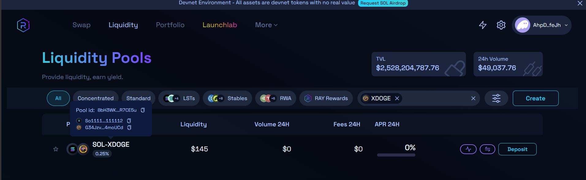

# XDOGE on Solana 🚀

A hands-on blockchain project where I created and managed an SPL Token (**XDOGE**) on the **Solana Devnet** using the Solana CLI and SPL Token CLI.

This project was built to understand the fundamentals of Solana's account model, token creation process, token accounts, and on-chain asset management.

---

## 📌 Project Overview

XDOGE is a custom SPL token created on Solana Devnet. Through this project, I learned how fungible tokens are represented on Solana and how developers can interact with the blockchain using command-line tools.

---

## 🛠️ Tech Stack

- Solana CLI
- SPL Token CLI
- Solana Devnet
- Git & GitHub

---

## 🪙 Token Information

| Property | Value |
|-----------|---------|
| Token Name | XDOGE |
| Network | Solana Devnet |
| Token Standard | SPL Token |
| Mint Address | G34Jzvq5B5A3UCvmAZ79BQ8Typ4DZMGWGjkirs4moUCd |

---

## 🚀 What I Implemented

- Created a Solana wallet using Solana CLI
- Configured the wallet as the active signer
- Requested Devnet SOL through airdrop
- Created a new SPL Token mint
- Created a token account
- Minted XDOGE tokens
- Verified balances and token information
- Explored Solana's account-based architecture

---

## 🏗️ Solana Token Architecture

```text
Wallet
   │
   ▼
Mint Account (XDOGE)
   │
   ▼
Token Account
   │
   ▼
XDOGE Tokens
```

---

## 📚 Key Concepts Learned

### Mint Account
Stores token metadata and controls token supply.

### Token Account
Stores the balance of a specific token owned by a wallet.

### SPL Token Program
A reusable Solana program that manages fungible tokens across the network.

### Solana Account Model
Solana separates program logic from data storage, enabling efficient and scalable blockchain applications.

---

## 🔍 Explorer

https://explorer.solana.com/address/G34Jzvq5B5A3UCvmAZ79BQ8Typ4DZMGWGjkirs4moUCd?cluster=devnet

---

## 💻 Commands Used

### Create Wallet

```bash
solana-keygen new --outfile my-memecoin-wallet.json
```

### Configure Wallet

```bash
solana config set --keypair my-memecoin-wallet.json
```

### Check Balance

```bash
solana balance
```

### Create SPL Token

```bash
spl-token create-token
```

### Create Token Account

```bash
spl-token create-account G34Jzvq5B5A3UCvmAZ79BQ8Typ4DZMGWGjkirs4moUCd
```

### Mint Tokens

```bash
spl-token mint G34Jzvq5B5A3UCvmAZ79BQ8Typ4DZMGWGjkirs4moUCd 1000
```

### View Token Accounts

```bash
spl-token accounts
```

### Check Token Supply

```bash
spl-token supply G34Jzvq5B5A3UCvmAZ79BQ8Typ4DZMGWGjkirs4moUCd
```

## 🌊 Raydium Liquidity Pool

After creating the XDOGE SPL token, I provisioned liquidity on Raydium Devnet by creating a SOL/XDOGE liquidity pool.

### Pool Details

- Pair: SOL / XDOGE
- Platform: Raydium Devnet
- Pool Type: Standard AMM Pool

### Learning Outcomes

- Understanding Automated Market Makers (AMMs)
- Liquidity Pool Creation
- Token Pair Configuration
- Initial Liquidity Provisioning
- Token Trading Infrastructure on Solana

### Screenshot



## 🎯 Learning Outcome

This project provided practical experience with:

- Solana blockchain fundamentals
- SPL token creation and management
- On-chain accounts and ownership
- CLI-based blockchain development workflows

---

## 🚧 Future Improvements

- Add token metadata
- Learn Program Derived Addresses (PDAs)
- Build a custom Solana program
- Create a complete Solana dApp around the token

